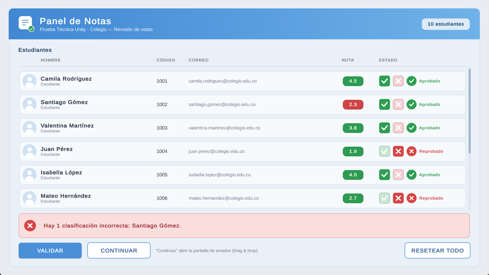
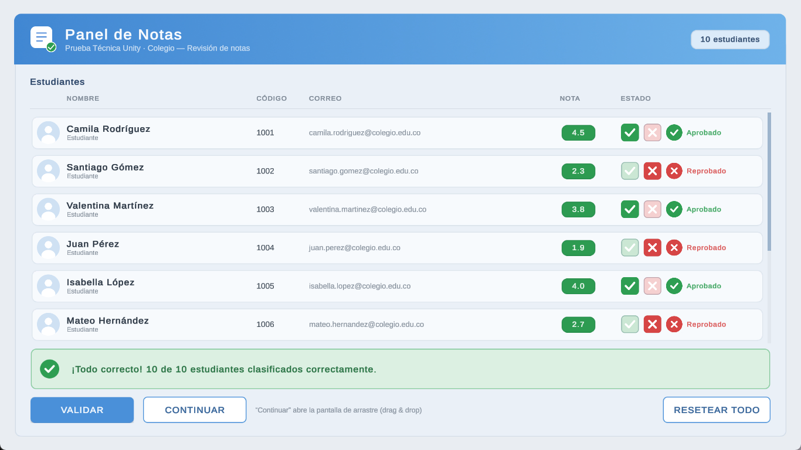

# Prueba Técnica Unity — Panel de Notas

## Descripción

Aplicación para que un profesor revise y clasifique las notas de sus estudiantes.

- Carga los estudiantes desde un archivo JSON externo.
- Construye la tabla de notas dinámicamente a partir de esos datos.
- Permite marcar a cada estudiante como **Aprobado** o **Reprobado** mediante Toggles.
- **VALIDAR** compara cada clasificación con la nota real e indica aciertos y errores.
- **CONTINUAR** abre una segunda pantalla donde los mismos estudiantes se clasifican arrastrando tarjetas.
- **VERIFICAR CLASIFICACIÓN** valida el resultado del drag & drop con las mismas reglas.

## Versión de Unity

**Unity 2022.3.62f2 LTS.** El enunciado permite usar Unity 6 o una versión LTS; se eligió 2022.3 LTS por estabilidad.

## Ejecución del proyecto

1. Clonar el repositorio:
   ```
   git clone https://github.com/CindySolano95/PruebaTecnica_CloudLabs.git
   ```
2. Abrirlo desde Unity Hub con **Unity 2022.3.62f2 LTS**.
3. Abrir la escena `Assets/Scenes/Main.unity`.
4. Pulsar **Play**.

## Ejecutable

1. Descomprimir `PruebaTecnica_Unity_CindySolano.zip`.
2. Ejecutar `PruebaTecnica_CloudLabs.exe`.

El `.exe` debe permanecer en la misma carpeta que los archivos generados por Unity:

```
PruebaTecnica_CloudLabs.exe
PruebaTecnica_CloudLabs_Data/
MonoBleedingEdge/
UnityPlayer.dll
UnityCrashHandler64.exe
```

La aplicación abre en una ventana redimensionable de 1280×720, útil para comprobar el comportamiento responsive. `Alt+Enter` alterna pantalla completa. Para abrirla con una resolución concreta:

```
PruebaTecnica_CloudLabs.exe -screen-fullscreen 0 -screen-width 1366 -screen-height 768
```

## Datos

| Ubicación | Ruta |
|---|---|
| Proyecto | `Assets/StreamingAssets/estudiantes.json` |
| Build | `PruebaTecnica_CloudLabs_Data/StreamingAssets/estudiantes.json` |

```json
{
  "estudiantes": [
    { "nombre": "Camila", "apellido": "Rodríguez", "codigo": "1001",
      "correo": "camila.rodriguez@colegio.edu.co", "notaFinal": 4.5 }
  ]
}
```

- No hay estudiantes hardcodeados en scripts, escena, prefabs ni Inspector.
- Toda la interfaz se construye a partir del JSON, así que se adapta a cualquier cantidad de estudiantes.
- Para cambiar los datos basta con editar el JSON y **reiniciar la aplicación**. La recarga en caliente era un plus opcional y no se implementó.

**Regla de aprobación:** `notaFinal >= 3.0` → aprobado. Está centralizada en un único lugar, `StudentData.IsApproved`.

## Arquitectura

```
Assets/Scripts
├── Data        StudentData · StudentCollection · StudentClassification
├── Services    StudentRepository · ClassificationValidator · ValidationResult · ClassificationOutcome
├── UI          AppController · GradesPanelController · StudentRowView · ResultBannerView
└── DragDrop    DragDropPanelController · StudentDragItem · StudentDropZone
```

**Data**
- `StudentData`: modelo del JSON y regla `IsApproved`.
- `StudentCollection`: raíz del JSON.
- `StudentClassification`: `Unclassified` / `Approved` / `Failed`.

**Services**
- `StudentRepository`: lee y sanea el JSON sin lanzar excepciones.
- `ClassificationValidator`: compara clasificaciones con `IsApproved`. Lo usan las dos pantallas.
- `ValidationResult` / `ClassificationOutcome`: resultado global y por estudiante.

**UI**
- `AppController`: punto de entrada. Carga los datos una vez, coordina la navegación y RESETEAR TODO.
- `GradesPanelController` / `StudentRowView`: tabla de notas y cada fila.
- `ResultBannerView`: banner de éxito o error, compartido por ambas pantallas.

**DragDrop**
- `DragDropPanelController`: crea las tarjetas y verifica.
- `StudentDragItem`: tarjeta arrastrable, dueña de su clasificación.
- `StudentDropZone`: recibe tarjetas y les asigna la clasificación de la zona.

Flujo:

```
estudiantes.json → StudentRepository → StudentData → UI dinámica → ClassificationValidator → feedback
```

Las vistas no leen datos por su cuenta ni validan: reciben `StudentData` mediante `Setup(...)`. Las referencias se asignan por `[SerializeField]` y los listeners se conectan por código. No se usan `Find`, singletons ni `Update`.

## Pantalla de notas

- Una fila por estudiante, generada desde un prefab dentro de un **ScrollView**.
- Cada fila tiene dos Toggles (Aprobado / Reprobado) en un `ToggleGroup` que permite desmarcar. Estados posibles: **Unclassified**, **Approved** o **Failed**, reforzados con icono y texto de estado.
- **VALIDAR** compara cada fila con su nota y muestra un banner:
  - todo correcto → banner verde con el total;
  - con errores o pendientes → banner rojo con los estudiantes afectados.
- Tras validar, la nota de cada fila se colorea. **Verde indica que la clasificación del profesor es correcta y rojo que es incorrecta**; no indica directamente si el estudiante aprobó. Las filas sin clasificar quedan neutras.
- Cambiar una clasificación después de validar limpia el feedback obsoleto.
- **RESETEAR TODO** aparece cuando todos los estudiantes están clasificados y limpia ambas pantallas.

## Drag & Drop

- **CONTINUAR** abre la pantalla usando **las mismas instancias de `StudentData`**; el JSON no se vuelve a leer.
- Cada estudiante es una tarjeta arrastrable. Hay tres zonas: **Sin clasificar**, **Aprobado** y **Reprobado**. Una tarjeta puede moverse entre cualquiera de ellas, incluso de vuelta a Sin clasificar.
- Si se suelta fuera de una zona válida, la tarjeta vuelve a su posición de origen.
- Todas las zonas tienen scroll interno, así que ninguna tarjeta queda inaccesible aunque todos los estudiantes estén en la misma zona.
- **VERIFICAR CLASIFICACIÓN** usa el mismo validador y banner que la pantalla de notas.
- **VOLVER** regresa a la tabla. Cada pantalla conserva su propio estado al ir y volver.
- **RESETEAR TODO** aparece cuando no quedan tarjetas sin clasificar y limpia ambas pantallas.

## Robustez

La carga del JSON contempla:

- archivo inexistente;
- archivo vacío;
- JSON inválido;
- lista vacía o ausente;
- campos de texto incompletos, que se muestran como "—";
- nota ausente;
- notas fuera del rango 0.0–5.0.

Los estudiantes sin nota válida se descartan con un aviso en el log. Si no se puede cargar ningún estudiante, la aplicación **no se cierra**: muestra el motivo en el banner, por ejemplo "No se encontró el archivo estudiantes.json.".

## UI y assets

- **Canvas Scaler**: *Scale With Screen Size*, referencia **1920×1080**, match 0.5. Verificado en **1920×1080** y **1366×768**.
- Estructura con anchors, **Horizontal/Vertical Layout Groups**, **LayoutElement**, **ContentSizeFitter** (solo en los contenidos de scroll), **ScrollRect** y **RectMask2D**.
- Todos los textos usan **TextMeshPro**.
- `UI_Atlas.png` está recortado en **22 sprites** con nombres descriptivos y empaquetado en un **Sprite Atlas V2** (`UI_SpriteAtlas`), sin rotación ni tight packing.
- **9-slice** en botones, tarjetas, banners, encabezado y zonas de drop. Los bordes de las zonas protegen la etiqueta integrada en el sprite.
- Estados visuales:
  - **Botones:** Sprite Swap (primario: normal/hover/pressed/disabled; secundario: normal/pressed).
  - **Toggles:** sprites del kit para desmarcado y marcado, con una pista tenue de ✓/✗, más Color Tint para hover/pressed, ya que el kit no incluye sprites de esos estados para toggles.
- **Color Space Gamma**: al ser una aplicación de UI 2D, se priorizó que los colores de TextMeshPro y del kit gráfico se vieran exactamente como están definidos.

## Controles

**Pantalla de notas**
- Clic en la casilla ✓ (Aprobado) o ✗ (Reprobado); un segundo clic la desmarca.
- **VALIDAR**, **CONTINUAR**, **RESETEAR TODO**.
- Rueda del ratón o scrollbar para recorrer la lista.

**Drag & Drop**
- Arrastrar tarjetas con el botón izquierdo.
- Rueda del ratón, scrollbar o arrastre en un espacio libre para desplazar las listas.
- **VERIFICAR CLASIFICACIÓN**, **VOLVER**, **RESETEAR TODO**.

## Limitaciones conocidas

- Los cambios en `estudiantes.json` requieren reiniciar la aplicación.
- Las tarjetas capturan el gesto de arrastre, así que el scroll se hace con la rueda, la scrollbar o un espacio libre de la lista.
- `JsonUtility` no distingue `"notaFinal": null` de `0`. Una nota *ausente* sí se detecta y se descarta.

## Screenshots

**Pantalla de notas — 1920×1080** (validada, con una clasificación incorrecta)



**Drag & Drop — 1920×1080** (clasificación verificada)


**Pantalla de notas — 1366×768** (todo correcto)



**Drag & Drop — 1366×768** (clasificación en curso)


